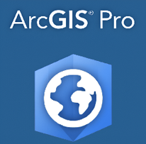

<h1 align="center">
  Denise 
  Hernández
  
</h1>

<h3 align="center">GIS Analyst | Spatial Data | Network Analysis | Data & Automation</h3>

GIS Analyst enfocada en análisis geoespacial, calidad de datos y optimización de procesos.  
Actualmente desarrollando soluciones GIS aplicadas a infraestructura, análisis de datos, automatización y tecnologías basadas en IA.

---

# 🚀 Sobre mí

- Analista GIS con experiencia en infraestructura energética y redes viales  
- Especializada en modelado geoespacial, Network Analyst y validación de datos  
- Experiencia en limpieza, normalización y control de calidad de bases GIS  
- Trabajo colaborativo con equipos técnicos (energía, integridad, operaciones)  
- Interés en automatización, análisis de datos y optimización de workflows  
- En constante aprendizaje en IA aplicada, Python y análisis avanzado de datos  

---

# 🛠️ Tecnologías y Herramientas

## 🌍 GIS & Spatial Analysis

  
  
  

ArcGIS Pro • ArcGIS Online • Leaflet

---

## 🌐 WebGIS & Interactive Mapping

  

  

  

  

<a href="https://www.openstreetmap.org/" target="_blank">OpenStreetMap</a> • 
<a href="https://denplus007.github.io/ecommercemap-parque-patricios/" target="_blank">WebGIS</a> • 
Interactive Mapping • Spatial Visualization

---

## 📊 Data Analytics

  

Python • MySQL • SQLite

---

## 📈 Visualization

  
  

Power BI • Tableau

---

## ⚙️ Automatización & Desarrollo

  
  
  

GitHub • VS Code • ChatGPT • Google Colab

---

## 🤖 IA aplicada

  
  
  

Claude • GitHub Copilot • AI Agents • n8n

---

# ⚡ Experiencia clave

- Gestión y actualización de redes viales y eléctricas en GIS  
- Edición y validación de líneas eléctricas, ductos y accesos  
- Modelado de redes (conectividad, endpoints, topología)  
- Control de calidad de datos (atributos, geometría, consistencia)  
- Normalización de bases de datos y resolución de inconsistencias  
- Diseño de workflows para captura, validación y carga de datos  
- Coordinación con equipos de campo e integridad  
- Seguimiento de reemplazos de ductos y actualización en GIS  

---

# 🧠 Explorando en 2026

- Automatización de procesos GIS con Python  
- Integración GIS + Data Analytics  
- AI aplicada a análisis y desarrollo  
- Modelado de datos y workflows inteligentes  
- Sistemas basados en agentes IA  
- Mejora continua en calidad y gobernanza de datos  

---

# 📂 Proyectos Destacados

## 🌎 EcoMap PP — Interactive Commercial & Regulatory Risk Map

  

  

  

Aplicación WebGIS interactiva desarrollada para visualización y análisis territorial de comercios en Parque Patricios (CABA), incorporando clasificación comercial, mapas de calor y lógica de riesgo regulatorio.

### 🔹 Funcionalidades

- Visualización geoespacial interactiva
- Heat Map de Riesgo Regulatorio
- Clasificación de comercios por categoría
- Popups dinámicos con información contextual
- Integración OpenStreetMap + Leaflet
- Análisis exploratorio territorial

### 🛠️ Tecnologías

<a href="https://leafletjs.com/" target="_blank">Leaflet</a> • 
<a href="https://developer.mozilla.org/en-US/docs/Web/JavaScript" target="_blank">JavaScript</a> • 
<a href="https://developer.mozilla.org/en-US/docs/Web/HTML" target="_blank">HTML</a> • 
<a href="https://developer.mozilla.org/en-US/docs/Web/CSS" target="_blank">CSS</a> • 
<a href="https://www.openstreetmap.org/" target="_blank">OpenStreetMap</a> • 
<a href="https://pages.github.com/" target="_blank">GitHub Pages</a>

### 🚀 Demo & Repositorio

🌐 <a href="https://denplus007.github.io/ecommercemap-parque-patricios/" target="_blank">Demo Web</a>

💻 <a href="https://github.com/DenPlus007/ecoomercemap-parque-patricios" target="_blank">Repositorio GitHub</a>

### 📚 Contexto

Proyecto desarrollado como práctica aplicada de un curso de Mapas Interactivos con Leaflet (Udemy), expandido con conceptos de análisis territorial, visualización GIS web y lógica de riesgo regulatorio.

---

## 🛢️ Pipeline Replacement Tracking

  

Seguimiento, validación y actualización de ductos en GIS, asegurando calidad y consistencia de datos.

---

## ⚡ Electrical Network Modeling

  

Modelado y edición de redes eléctricas, incluyendo líneas, subestaciones y equipos.

---

## 🛣️ Road Network Management

  

Edición y análisis de caminos de acceso, conectividad y jerarquía de red.

---

## 🧹 Data Cleaning & Standardization

  

Procesos de saneamiento y normalización de bases GIS con mejora de calidad y eficiencia.

---

# 📚 Actualmente enfocada en

✔️ Network Analysis en ArcGIS  
✔️ Python aplicado a GIS  
✔️ SQL y análisis de datos  
✔️ Data Quality & Data Governance  
✔️ Automatización de workflows  
✔️ AI-assisted development  
✔️ WebGIS & Interactive Mapping  

---

# 🌍 Conecta conmigo

🔗 <a href="https://www.linkedin.com/in/denise-hern%C3%A1ndez-a3071968/">LinkedIn</a> 
📧 <a href="mailto:denise.hernandez.ar@gmail.com">denise.hernandez.ar@gmail.com</a> 
📓 <a href="https://quickest-stream-2d8.notion.site/Portafolio-GIS-Denise-Hern-ndez-3069dd2d2c5781cd9539e5bdc0ba14fe?pvs=74">Portafolio Notion</a>

---

⭐ Construyendo soluciones geoespaciales con impacto real

